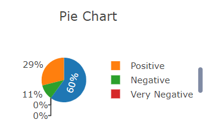
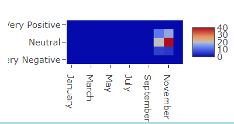
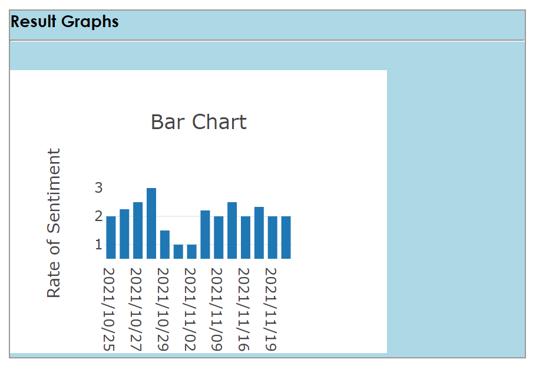

# github link

https://github.com/CMU-17-214/hw6-analytics-framework-teamhhs/commit/ab6c209cf78b0347aaafdcae21e72badee941f04

# Bonus

We would like to apply for the following bonus points

- 20: ML library data processing 
- 5: git action 
- 5: git pull request

# Usage

- pre-req
  - make sure you have node.js and npm installed in your local env.
  - 
  - make sure you have IDE with mvn support
  - make sure localhost port 3000 & 4000 are free to use

## Download 

- `git clone <our_repo>`

## Front-end

- `cd <repo_root>`
- `cd front_end`
- `npm install`
- `npm start `

### Back-end

- load project in IDE(IDEA recommened)
- run the project
- NLP library is extremely slow, expecting 10-30s for a single graph with 20 entries to process


# Idea

## Framework

- The idea of the project is to implement a sentimental analysis framework. 
  - The idea is to perform sentiment analysis (how positive the tone of some text is) on different texts. The framework performs the sentiment analysis on text from different sources (provided by data plugins) and shows results in different ways (using visualization plugins). The framework performs the sentiment analysis itself, hence provides benefits for reuse. Further reuse benefits come from being able to reuse existing visualizations when just providing a new data plugin or vice versa.

- The framework is extensible in terms of 
  - Data plugins: Add more data sources to anaylsis.
  - Visualization plugins:  Add more graphs.

- The framework consists of two parts: 

  - Front-end: We use `react` for front-end design, that takes in the user requirements and send a JSON request to the back-end. When Back-end returns the data, we parse that data and use `plotly` to create graphs.

  - Back-end: We use `SpringBoot` for back-end design, take takes in JSON input and 

    0) parse input json object
    1) allocate data plugins
    2) download data using data plugins
    3) allocate process plugins
    4) process data using process plugins (filter)
    5) allocate NLP plugins
    6) process data using ML algorithms
    7) allocate visualization plugins
    8) load data to JSON object with the correct format for plotting.

- **What do you need to do to add plugins ?** 

  - Data plugin: 

    - Implement `dataPlugin` interface (see code documentation for more details)

    - add your implementation into `beanFactory.xml`

      ```xml
      <!-- example adding data plugins -->
      <bean name="<your_datasource_name>DataPlugin"
            class="edu.cs.visframework.dao.<your_implementation>">
      </bean>
      ```

      

  - Visualization plugin:

    - Implement `visualizationPlugin` interface (see code documentation for more details)

    - add your implementation into `beanFactory.xml`

      ```xml
      <!-- example adding data plugins -->
      <bean name="<your_graph_name>VisPlugin"
            class="edu.cs.visframework.dao.<your_implementation>">
      </bean>
      ```

  - NOTE: 

    - <your_datasource_name> or <your_graph_name> is coupled to the front-end input (user needs to input the exact name of your choice in order to use your plugin) 

      For example: 

      if you want user to type`youtube` as data source, you need to set <your_datasource_name> as `youtube`

      if you want user to type`new_graph` as graph name, you need to set <your_graph_name> as `new_graph`

      

  

- Design patterns:

  - We use MVC pattern for back-end design that separates controller and the actual service implementation.

  - We use factory pattern to allocate plugins dynamically.

  - We use strategy pattern for data/graph plugins for extensibility and flexibility.

    

## Plugin implementations

### Data plugins

#### YouTube Plugin
Take video id as dataSourceUrl, i.e. for a video whose url is https://www.youtube.com/watch?v=Ku2zZ5Vfpzo, the input should be Ku2zZ5Vfpzo, return 20 comment entries by default.

#### Twitter Plugin
Twitter plugin takes in a username as the data source and searches the latest 100 posts from the user. For example, 
To search posts from Elon Musk (Twitter username : @elonmusk), we should enter "elonmusk" as a string.  

#### News Plugin
News plugin takes in a single word as the search key word. The plugin will then return descriptions of the first 20 news 
related to the given keyword. For example, to search news related to CMU, we should enter "cmu" as a string. 

### Visualization plugins

#### Pie Plugin
Visualize the portions of all 5 sentiments.   


#### Heatmap Plugin
Visualize the occurrence time of each sentiment state in each month


#### Bar chart Plugin
Visualize the sentiment rates for selected data in ordered dates.
