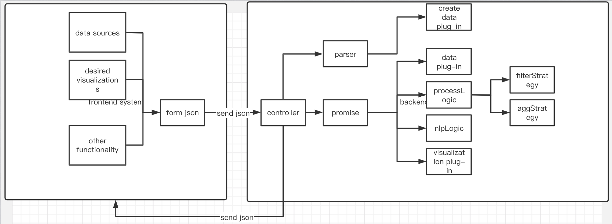

# Domain
Our project is to design a sentiment analysis framework on different texts. Sentiment analysis is a NLP algorithm that 
measures the tone of given texts. The framework performs the sentiment analysis on text from different sources (provided
by different data plugins) and shows results in different ways (different types of graphs by visualization plugins). The 
framework acts like a controller which coordinates client requests from website frontend to corresponding plugins. The 
framework also performs shared NLP sentiment analysis and stores general intermediate data and configurations. 

Data plugins could take client configured requests and output a list of text fragments for the framework to perform 
sentiment analysis:
 - Twitter plugin takes in the selected hashtags or username. Use the Twitter API to filter out related Twitter 
messages, then output obtained messages to a json file.
 - YouTube plugin takes in a video URL or a video name. Search comments for the selected video using YouTubeData API, 
then output related video comments to a json file.
 - News plugin takes news titles or topics. Search for related news from New API, then output them to a json file.

Visualization plugins get sentiment analysis results from the framework, then outputs different graphs based on client 
configurations. We will use public API Plotly to generate different graphs:
 - Pie chart plugin that displays portions of different sentiments in texts.
 - Bar graph indicates the magnitude of different sentiments. 
 - Word cloud displays text fragments with the highest sentiment magnitudes, and indicates their sentiment by 
different colors (eg. red for positive, blue for negative, yellow for neutral).
 
# Generality vs Specificity
For the purpose of our NLP sentiment analysis, we want our users to have enough flexibility to load data from different 
data resources, but we don't want too many public extension points that may cause the framework hard to learn and use. 
The key idea here is to separate common parts in the framework from extensible variable plugins. In this section, 
we will discuss the key abstraction for our framework, and potential flexibility of plugins.

The framework will provide an interactive web-based front end. Clients should be able to configure their data input and 
visualization requests from a shared GUI. Having framework shared GUI helps us to control the scope of our framework 
and plugin API. We want our users to have different options, but their selections should be supported and compatible with 
our framework. The framework also acts as a controller and parser for the program. After received the responses from the 
front end website, the framework parses the client requests to Map<String,String> and initializes plugin instances 
accordingly. We make the parser shared because we want a uniformed request format that is required by our data plugin API.
In addition, the core NLP sentiment analysis algorithm and data process logic should also be implemented in the framework.
Currently, since we only decide to support one NLP sentiment analysis (score & magnitude analysis) with limited data process 
logics (data aggregation & date filtering), we treat them as internal plugins (fixed and private plugins inside the framework).
In the future, when we found it's necessary for clients to have their own NLP analysis logics, we may release these plugin
APIs as public. Processed data will be stored by the framework in a Map<String, String> form with sentiment score&magnitude
of selected text fragments. This data will later be passed to the visualization plugins for specified graphs after the framework 
received a client visualization request from the webGUI.

Data Plugin takes in a request form of Map<String, String> and output a JasonObject with gained text data. Right now, we
decided to only support input and output data form as mentioned above. Because supporting more Data plugin output forms, such 
as txt, xml, and csv files, will make our code too generic and introduce strong couplings between plugins and framework
(framework will need to be compatible with all those data file types). This will make the framework internal functions 
complex to implement and unfriendly for reuse.

Visualization Plugin takes in sentiment analysis results in a form of Map<String, String>. It then formats the result by 
specified public plotting APIs (eg. plotly) to JSON for front-end website render to generate graphical responses to user 
requests. Visualization Plugins can be customized by users with our defined API.


# Project Structure

- Our project consists of two parts: front-end and back-end. The majority of work are done in back-end and the rendering are taken care by the front-end.

  

  - front-end: input the desired feature & data sources via HTML web page and Json.

    - data sources: Input data sources using HTML TextEditor 

    - desired visualizations: Input data sources using HTML TextEditor 

    - other functionality: Input data sources using HTML TextEditor 

      

  - back-end: All the logics are stored in the backend.

    - controller: Controller is the component that listens for **Json** input data from the client(front-end)

    - parser: Parser is the component that parses the input data and create plugins accordingly for later use.

    - promise: Promise is where we send Json data to different plugins and wait for their results. 

      - **data plugin**: Taking care of data download from data sources, return List of Strings.

      - **process logics**: Taking care of aggregation / filtering of the downloaded data, return List of Strings.

      - **nlp logics**: Taking of the nlp analysis of the processed data return Map<String, String>.

      - **visualization plugin**: Taking care of the visualization part of the data, format the data to JSON for particular Front-end render libraries to use.

        

  - design considerations:
    - plugin creation: In the **parser** of the framework, we create those plugins for later use.
    - plugin calling: We use promise to call plugin functions in a asynchronous manner due to the fact that some downloading procedure may be slow.

# Plugin interfaces
```java
public interface DataPlugin {
    /**
     * Get the source of data
     */
    public String getSource();

    /**
     * Get the range of time for the extracted data
     */
    public List<Date> getDateRange();

    /**
     * Extract data from the config parsed by frame
     * @param config Config from front end request, parsed by frame
     */
    public JSONObject getData(Map<String, String> config);
    

    /**
     * Called (only once) when the plug-in is first registered with the
     * framework, giving the plug-in a chance to perform any initial set-up
     */
    public void OnRegister(Framework framework);
}


public interface VisualizationPlugin {

    /**
     * Get the rendered json data and layout config, send to front end library for visualization
     * @param data Processed data sentiment results from framework
     * @param config Config from frontend
     * @return JSON for particular Front-end render libraries to use
     */
    public JSONObject renderData(Map<String, String> data, Map<String, String> config);

    /**
     * Called (only once) when the plug-in is first registered with the
     * framework, giving the plug-in a chance to perform any initial set-up
     */
    public void OnRegister(Framework framework);
}

```
